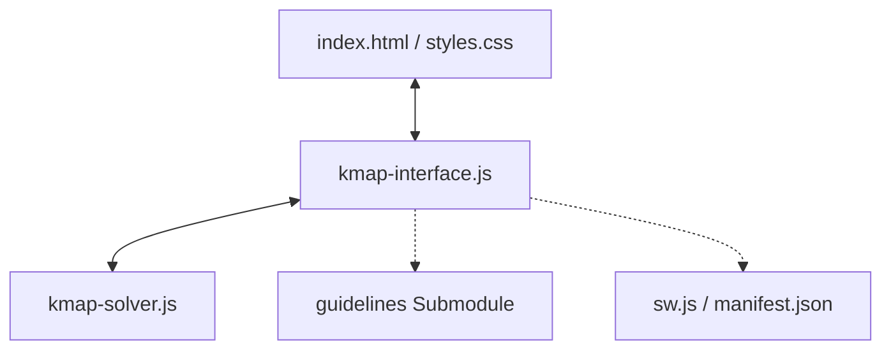

# Web K-Map Solver

A dependency-free, interactive Karnaugh map (K-map) solver for 2–4 variables. Instantly simplifies Boolean functions to minimal Sum-of-Products (SOP) expressions with real-time SVG group overlays, truth table synchronization, and a mobile-friendly PWA interface.

---

## Technical Architecture

The application is built using vanilla web technologies and adheres to a custom token-based design system via a Git submodule.

* **Solver Engine (`kmap-solver.js`):** Custom K-map prime-implicant enumeration that scans all valid cell groups in the grid to identify prime implicants and calculate all minimal Boolean covers.
* **Controller (`kmap-interface.js`):** Manages state synchronization between the grid and truth table, computes coordinates for dynamic SVG overlays, and handles tab switching.
* **Styling & Assets:** Utilizes design tokens from the `guidelines` submodule, rendering layout elements responsively via CSS Grid and Flexbox.
* **Offline Operations:** Service Worker (`sw.js`) provides full offline asset caching (cache-first policy).

---

## Features & Usage

* **State Cycling:** Click grid cells or truth table outputs to cycle: `0` → `1` → `X` (Don't Care).
* **Alternative Solutions:** Dropdown menu appears when multiple minimal expressions exist.
* **Layout Modes:** Toggle between Gray code ordering and traditional Binary ordering (for 3 and 4 variables).
* **Clean View:** Toggle "Hide Zeros" to display only active and Don't Care states.
* **Unicode Copy:** Copies solved expressions using notation like `A̅BC̅ + AD`.

---

## Variable Notation

* **A**, **B**, **C**, **D**: Active (1) states.
* **A̅**, **B̅**, **C̅**, **D̅**: Negated (0) states.
* **+** Operator: OR function.
* **Juxtaposition** (e.g., `AB`): AND function.
* **Example:** `A̅BC̅` represents `(NOT A) AND B AND (NOT C)`.

---

## Roadmap / TODO

- [ ] Optimize K-map SVG pathing for edge and corner wraparounds.
- [ ] Modularize `kmap-interface.js`.
- [ ] Implement a logic circuit diagram generator tab.
- [ ] Replace the solver with a Quine-McCluskey implementation to support more than 4 variables.

---

## Credits

* **Author:** [robonxt](https://github.com/robonxt)
* **Assistance:** Windsurf IDE / Claude
* **Logic Reference:** Inspired by `obsfx/kmap-solver-lib`
* **Icons:** Generated by Perchance